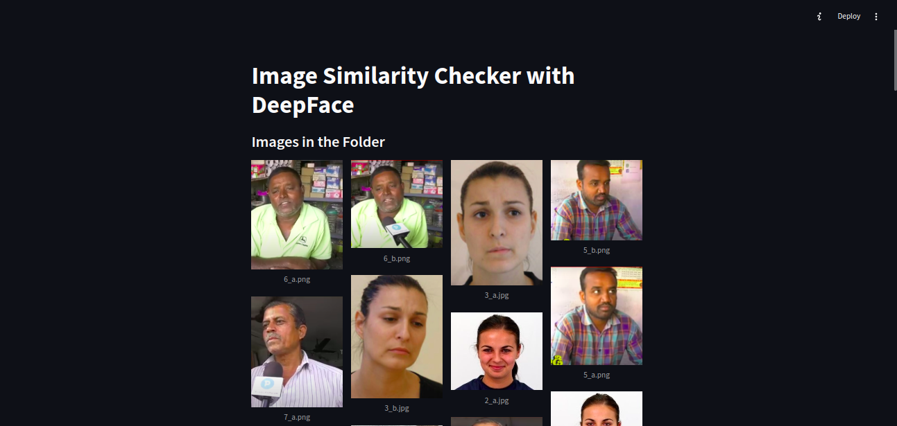
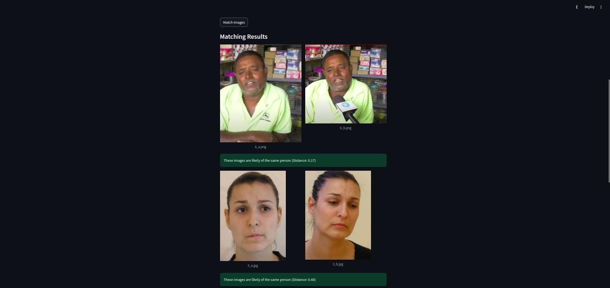
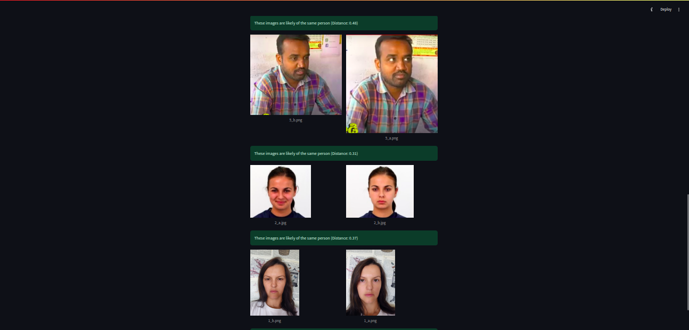

# Image Similarity Checker with DeepFace

This application uses the DeepFace library to compare images in a folder and check if they are likely of the same person. It provides an intuitive UI with Streamlit for displaying and comparing images.

## Features
- Load all images from a specified directory.
- Display images in a grid format.
- Perform pairwise comparisons between all images.
- Identify and display pairs of images that are likely of the same person.
- Show similarity results with distances calculated by DeepFace.

## Installation

1. **Clone this repository** (or download the code):
    ```bash
    git clone https://github.com/xelpmuzafer/face-similarity-checker.git
    cd face-similarity-checker
    ```

2. **Install the required Python dependencies**:
    ```bash
    pip install -r requirements.txt
    ```

3. **Set up the data folder**:
    - Create a folder named `data` in the project directory if does not exists.
    - Add your images (`.png`, `.jpg`, `.jpeg`) into the `data` folder.

## Usage

1. **Run the application**:
    ```bash
    streamlit run app.py
    ```

2. **Follow these steps on the Streamlit UI**:
    - View all the images loaded from the `data` folder.
    - Click the "Match Images" button to start comparing.
    - Review results to see which images are likely of the same person.

## Screenshots

### Home Screen


### Image Display


### Matching Results



## License
This project is licensed under the MIT License. See the LICENSE file for details.

## Acknowledgements
- [Streamlit](https://streamlit.io/)
- [DeepFace](https://github.com/serengil/deepface)
